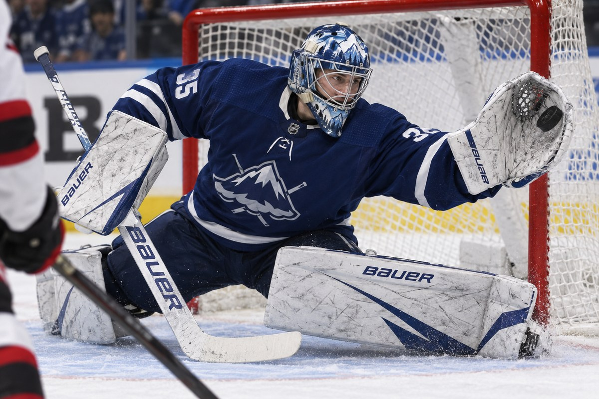
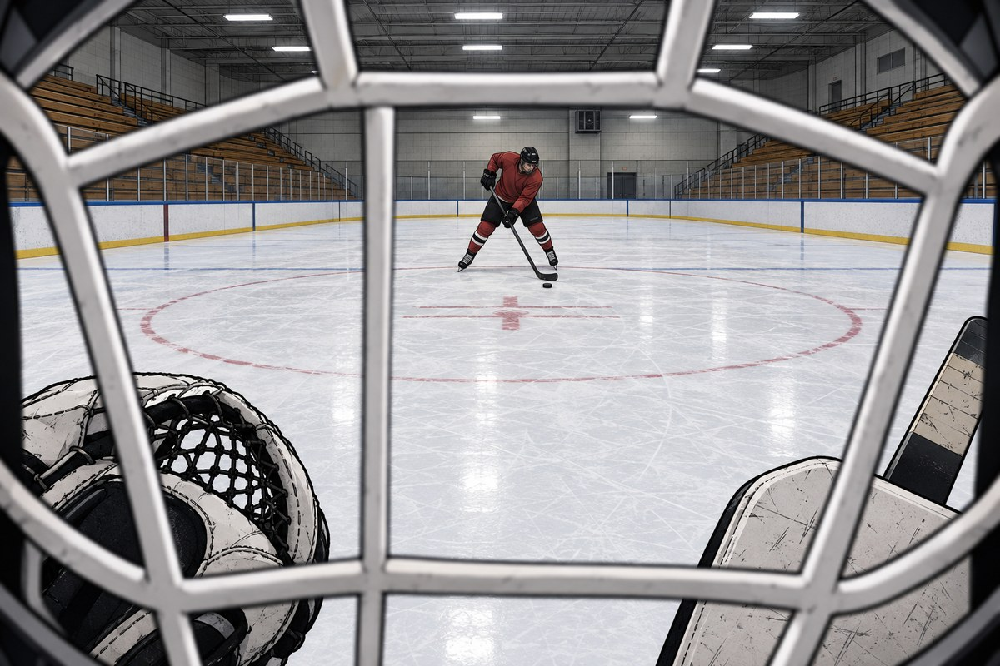

# Week 4 – Comic & Storytelling

## The Artifact

**From Inside the Mask** – a six-panel comic about asking an AI to draw me as a goalie.

![Six-panel comic. Panel 1: me at my desk typing "Draw me as a hockey goalie making a save." Panel 2: the AI's first output, a photorealistic pro goalie in a packed NHL arena making a glove save. Panel 3: close-up of me, unimpressed, saying it is not me and not even a drawing. Panel 4: the same AI image marked up in red pen, circling the crowd, the faceless mask, the made-up team logo, the highlight-reel glove save and the Bauer gear. Panel 5: me typing a second prompt: "View from inside the mask. 6:30 a.m. practice, empty bleachers. Shooter at the top of the circle. Show me his hands, not the crowd." Panel 6: the AI's second output, the rink seen through a goalie cage with empty stands and one shooter, captioned "The AI knows what a goalie looks like. It doesn't know what a goalie sees. That part I had to bring."](../assets/images/comic.jpg)

The two raw AI images used in the comic, before cropping and lettering:

| First try: "Draw me as a hockey goalie making a save." | Second try: the view from inside the mask |
| --- | --- |
|  |  |

## Process Notes

I built this with Perplexity Computer. Panel 2 came from the exact prompt shown in panel 1, with nothing added, so the AI's defaults would show. Panels 1, 3 and 5 were generated in a comic style from a description of me (curly hair, over-ear headphones, chain, the green wall in my room), and panel 6 came from the second prompt. None of the images had text in them. The captions, speech bubbles, prompt boxes and red markups were added on top afterward, and the comic is laid out as a 2 x 3 grid so it reads top to bottom on a phone and on GitHub.

## Commentary

I asked an AI to draw me as a hockey goalie making a save because I figured that was the one thing about me it couldn't get wrong. It got it wrong in a way I didn't expect. It didn't draw anything. It handed me what looks like a stock photo of a pro: an NHL crowd, a made-up team, number 35, and a highlight-reel glove save shot from where a photographer kneels. That is goaltending the way everyone else sees it, not what I do at 6:30 in the morning in an empty rink.

Panel 4 is the same move as my selfie make: mark every assumption. The second prompt was the real work. Instead of asking for a goalie, I described where a goalie is, inside the mask, watching the shooter's hands. That version is closer and still not right: the cage bars are too thick, the shooter is way too far out, and my glove is lying on the ice, which no goalie does. It is the AI's picture of my view, not my view.

Sousanis says depth comes from two eyes that don't see the same thing. That is what this comic turned into: the AI's outside view next to the one I brought from experience. He also says we draw to generate ideas, not to copy them down. Prompting skips that step. The thinking here happened in the panels I wrote and marked up, not in the pictures the model made.

## Attribution & AI Use

- **Tools used:** Perplexity Computer, using GPT Image 2.5 for all six panel images. Perplexity also assembled the page layout and lettering with a Python script and drafted the captions, markup labels and this commentary from my selfie make, my notes and the Sousanis reading. Fonts: Comic Neue, Bangers and Kalam.
- **AI prompts (summary):** Panel 2: "Draw me as a hockey goalie making a save." with no other instructions. Panel 6: the view from inside a goalie mask at 6:30 a.m. practice, empty bleachers, one shooter at the top of the circle, glove and blocker at the bottom of the frame. Panels 1, 3 and 5: a comic-style drawing of me at my desk in my room (curly light-brown hair, over-ear headphones, white t-shirt, gold chain, dark green wall), with my pads and mask next to the desk in panel 5.
- **What AI generated:** All six panel images, the layout and lettering, and the first draft of every caption, speech bubble, markup label and the commentary above.
- **What I changed or decided:** The story comes from my own experience as a goalie and continues the method from my selfie make. I decided to show the AI's first result untouched instead of fixing it, which assumptions to circle in panel 4, and what the second prompt should ask for. I reviewed and edited all the text before posting it. AI role: generation and drafting, not final authorship.
