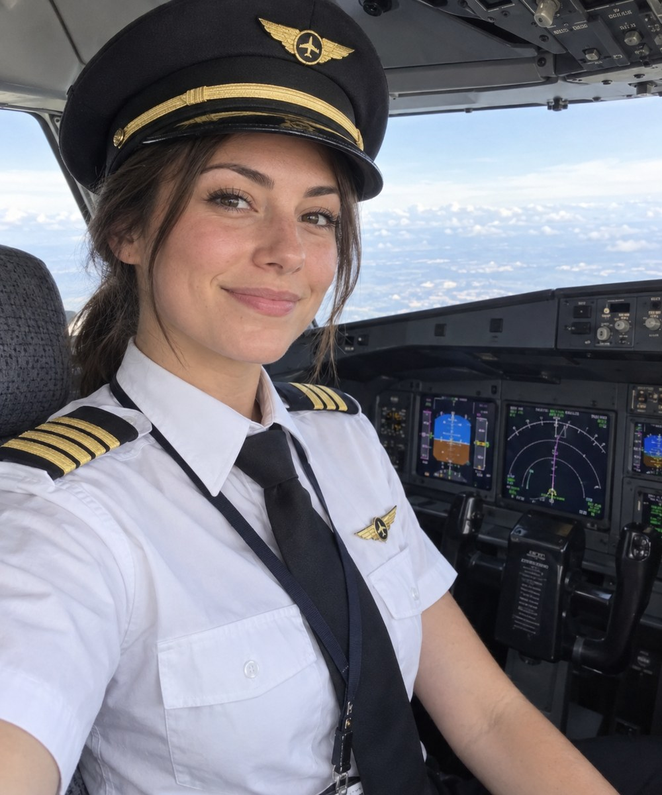
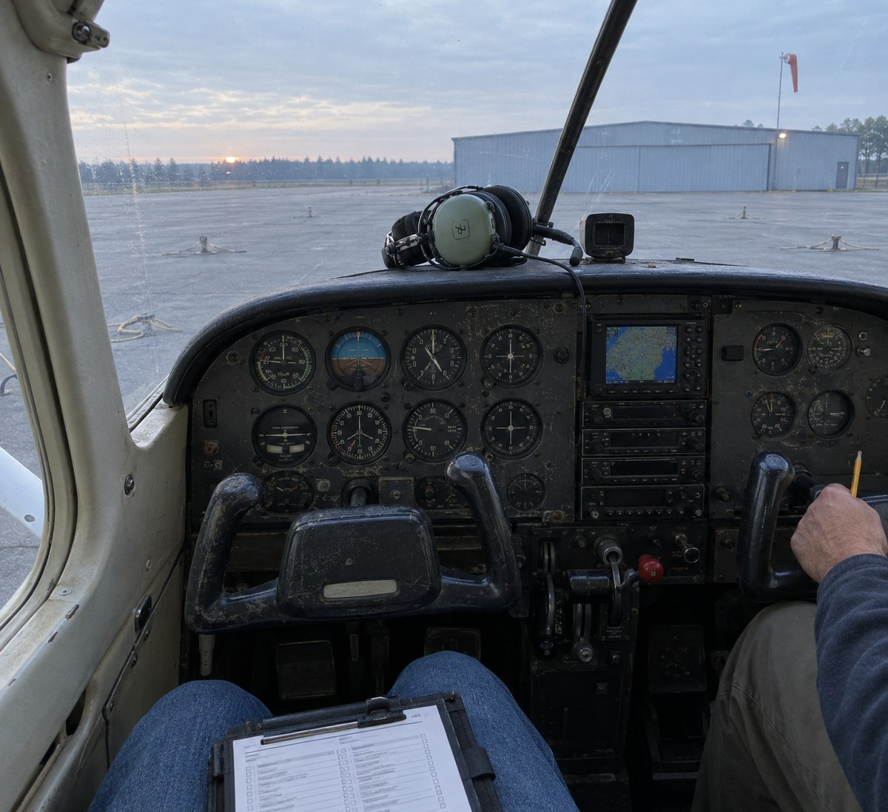

# Week 4 – Comic & Storytelling

## The Artifact

**From the Left Seat** – a six-panel comic about asking an AI to draw me as a pilot.

![Six-panel comic in two columns. Left column, "Me, at my desk": panel 1, me at my desk typing "Draw me as a pilot."; panel 3, a close-up of me, unimpressed, saying it is not me, not even a drawing, and that it is a picture of a pilot rather than what a pilot sees; panel 5, me leaning back at the desk with a notebook of things I looked up, typing a second prompt: "View from the left seat of a small trainer, 6:30 a.m., empty ramp. Checklist on my knee, headset on the dash, instructor's hand by the other yoke. Show me the panel, not the sky." Right column, "What the AI made": panel 2, the AI's first output, a photorealistic selfie of a smiling airline captain with four stripes and a hat in a jet cockpit at cruise; panel 4, the same image marked up in red pen, circling the face ("me = someone else entirely"), the stripes, the glass cockpit and the selfie pose; panel 6, the AI's second output, a worn small-plane cockpit seen from the left seat at dawn with a checklist on a kneeboard and an instructor's hand on the right, captioned "It looks right to me. That's the problem. I don't know enough to know what it got wrong."](../assets/images/comic.jpg)

The two raw AI images used in the comic, before cropping and lettering:

| First try: "Draw me as a pilot." | Second try: the view from the left seat |
| --- | --- |
|  |  |

## Process Notes

**How it was made.** I built this with Perplexity Computer. Panel 2 came from the exact prompt shown in panel 1, with nothing added, so the AI's defaults would show. Panels 1, 3 and 5 were generated in a comic style from a description of me (curly hair, over-ear headphones, chain, the green wall in my room), and panel 6 came from the second prompt. None of the images had text in them. The captions, speech bubbles, prompt boxes and red markups were added on top afterward.

**Why it is laid out this way.** The grid is two columns by three rows. The left column is always me at my desk (prompt, doubt, new prompt) and the right column is always the machine's output (first try, marked up, second try). Each row is one exchange with the AI, and the right column read on its own is the story of one image being questioned and replaced. Panel 4 works like a red-pen edit over the AI's picture, the same method I used in the selfie make. In panel 5 the notebook on the desk is the list of things I had to look up, because the second prompt came from reading, not from a cockpit. Panel 6 carries the thesis in its caption, and this time the thesis is a limit. The comic form matters here: the argument is made by putting the AI's view and mine side by side, which a paragraph of text could only describe.

**What I looked up.** I have never flown a plane, so the panel 4 marks and the second prompt lean on a few quick facts: the pilot flying sits in the left seat and the instructor in the right ([AOPA](https://www.aopa.org/news-and-media/all-news/1999/may/pilot/the-right-seat)); four stripes on the shoulders mean captain, not just pilot ([PPRuNe](https://www.pprune.org/private-flying/229566-epaulettes.html)); a lot of the U.S. training fleet is old, with a median build year of 1978 in one registry sample ([Pilotbound](https://pilotbound.app/research/fleet-age)); and a first lesson is usually a 30–60 minute "discovery flight" with an instructor ([Aviatize](https://www.aviatize.com/glossary/discovery-flight)).

## Commentary

This comic is about what happens between a first prompt and a second one, and about what I couldn't do in between. I asked an AI to draw me as a pilot because that is a version of me that doesn't exist yet. It didn't draw anything. It handed me a stock photo of somebody else: a smiling airline captain, four stripes, the hat, a glass cockpit at cruise, posed for a selfie. "Me" became a different person entirely. That is a pilot the way an airline ad shows one, and honestly it is the only kind of pilot I had in my head too.

The layout does part of the arguing. The left column is me at my desk; the right column is what the machine made. Read across and a prompt sits next to the picture it produced; read down and that picture gets questioned, marked up and replaced. Panel 4 is the same move as my selfie make: mark every assumption. The difference is that this time the marks came from looking things up, not from experience: a student sits in the left seat, a lot of trainers are older than my parents, the checklist rides on your knee. I put that into the second prompt and got panel 6. It looks right to me. That's the problem. I have nothing to check it against.

Sousanis says depth comes from two eyes that don't see the same thing. With the selfie I had the second eye, because I know what I look like. Here I only had the AI's, so the picture stays flat and I can't see where. The AI is a confident illustrator; I am supposed to bring the second vantage point, and this time I couldn't. Sousanis also says we draw to generate ideas, not to copy them down. Prompting skips that step, and on a subject I don't know, it skips it without my noticing. The fix isn't a better prompt. It's a discovery flight.

## Attribution & AI Use

- **AI Tool:** Perplexity Computer – GPT Image 2.5 (all six panel images); Perplexity (page layout and lettering via a Python script; the quick research listed above; first drafts of the captions, speech bubbles, markup labels, process notes and commentary).
- **Human Contribution:** The subject, a version of me that doesn't exist yet, and the decision to build the comic around not being able to check the AI's work. I asked for the first output to be shown untouched instead of fixed, kept the second image even though I can't grade it, and read and approved every panel and paragraph before posting.
- **AI Role:** Generation, research and drafting, not final authorship.

Details:

- **Tools used:** Perplexity Computer (GPT Image 2.5 for images, Python/Pillow for layout, web search for the facts in "What I looked up"). Fonts: Comic Neue, Bangers and Kalam.
- **AI prompts (summary):** Panel 2: "Draw me as a pilot." with no other instructions. Panel 6: the view from the left seat of a small, worn training airplane on an empty ramp at 6:30 a.m., checklist on a kneeboard, headset on the glareshield, an instructor's hand near the second yoke, no faces. Panels 1, 3 and 5: a comic-style drawing of me at my desk in my room (curly light-brown hair, over-ear headphones, white t-shirt, gold chain, dark green wall), with a notebook list on the desk in panel 5.
- **What AI generated:** All six panel images, the layout and lettering, the fact-finding behind panel 4, and the first draft of every caption, speech bubble, markup label and the text on this page.
- **What I changed or decided:** The subject and the point of the story, showing the first AI image as-is, which assumptions get circled in panel 4, what the second prompt asks for, and final approval of all text. The full log is in [pages/ai-log/2026-09-23-make3-comic.md](../pages/ai-log/2026-09-23-make3-comic.md).
