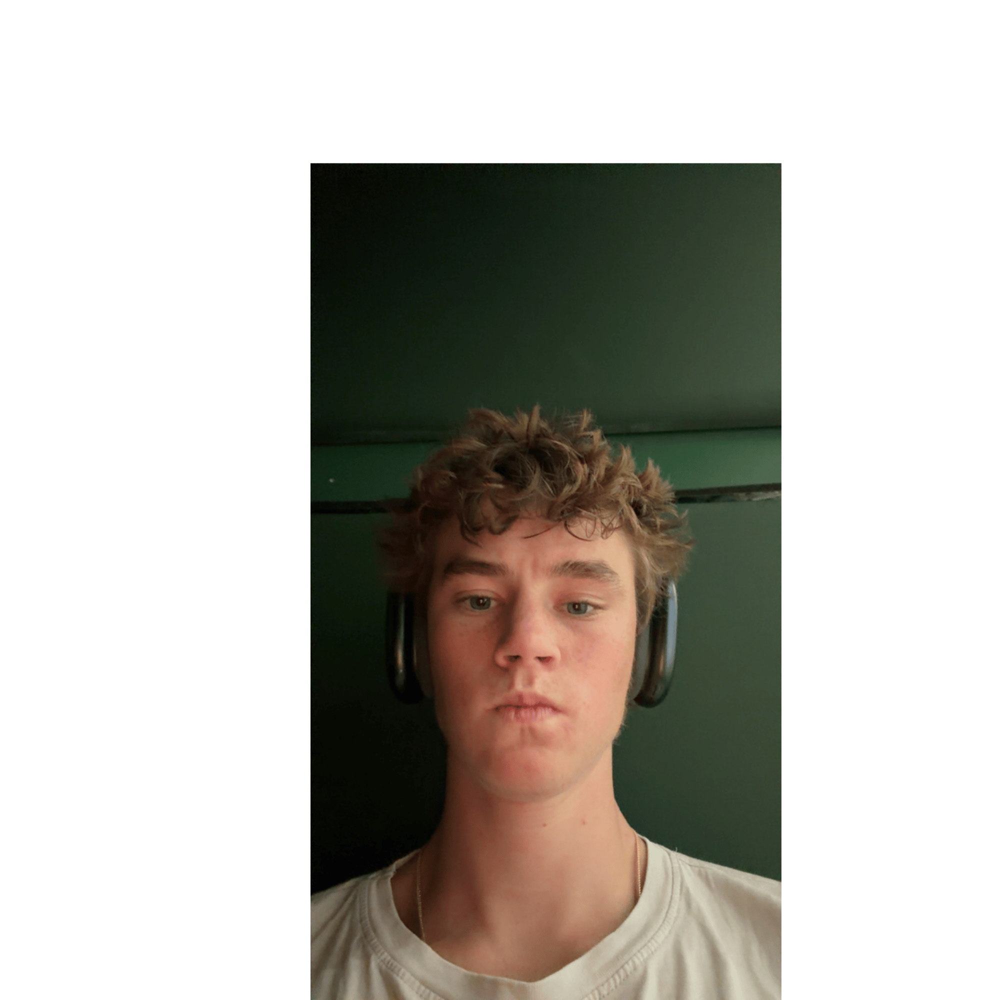
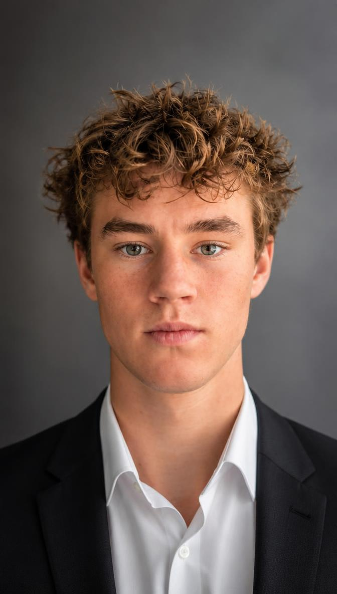
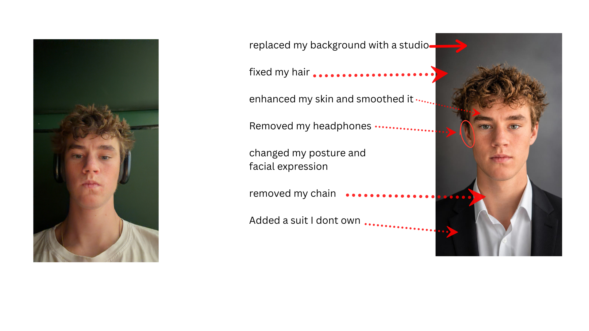

# Week 3 – Selfie & Identity

## The Artifact

## Process Notes
I uploaded a real photo of myself, taken in my room with my headphones on, to Canva AI and prompted it to make the photo look like a very professional and realistic headshot. Canva generated a studio-style headshot of me in a suit. For the second image, I placed my original photo next to the AI version in the Canva editor and added labels and arrows marking every change the AI made without being asked. My main decisions were the prompt, which photo to use, and choosing to make the AI's changes visible instead of trying to improve the image.

## Reflection
I gave Canva a normal photo of myself, sitting in my room with my headphones on, and asked it to make a very professional and realistic headshot. It came back with me in a dark suit and a white collared shirt against a gray studio background. Canva told me it had "preserved my natural facial features," and at first glance it did. The hair is right. The face shape is mine. If you showed it to someone who knew me, they would say it was me.

The longer I looked, the less I saw myself. My headphones are gone. My chain is gone. The green wall of my room turned into a studio. My skin is smoother than it has ever been, and my expression is a flat, serious stare that I do not actually make. The AI did not just clean up the photo. It decided what "professional" looks like and moved me into that template. A suit, a neutral background, no personality. That is not a version of me. It is the average of every corporate headshot it was trained on with my face placed on top.

That is the part that stuck with me. The parts of the image that are me are the parts I gave it. The parts it added are all assumptions about what a young man should look like when he wants to be taken seriously. Nobody asked for the suit. For the remix, I put my original photo next to the headshot and labeled every change the AI made on its own. I wanted to make the assumptions visible, because the things it decided were not worth keeping are the things that actually make the photo mine.

## Attribution & AI Use
- Tools used: Canva AI (image generation), Canva editor (remix and labels), Perplexity (drafted the reflection from my notes and observations, and helped organize the files in my repo)
- AI prompts (summary): Uploaded a real photo of myself and prompted "make this photo look like a very professional and realistic headshot of me."
- What AI generated: A studio headshot with a dark suit, white collared shirt, gray background, smoothed skin, and a neutral expression. It removed my headphones and chain but kept my hair and face shape.
- What you changed or decided: I chose the photo and the prompt, decided the suit and setting were the AI's assumptions rather than mine, and built the side-by-side remix labeling each change. I described what I noticed and Perplexity turned it into a draft, which I edited.
