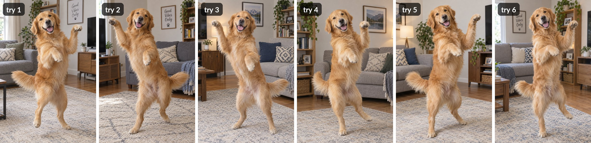

# Week 5 – GIF & Remix Culture

## The Artifact

**Good Vibes Only** – a 6-second loop made from one prompt sent to an AI image generator six times.

![Looping GIF. It opens on a dark chat box with the prompt "A golden retriever dancing in a living room." and the label "one prompt, sent six times, nothing added, × 6". Then six AI photos flash by at 0.4 seconds each, counted "try 1 of 6" through "try 6 of 6": every one is a golden retriever standing on its hind legs in the middle of a bright living room, one front paw raised, mouth open and tongue out, in front of a gray couch with geometric pillows, on a cream patterned rug, next to a wood shelf with a trailing plant. Half the frames have a framed "Good Vibes Only" sign on the wall; the other half have a mountain picture. Because the dog is in nearly the same spot in every frame, the flicker makes it look like it is dancing. The loop holds on the sixth image with red circles and labels: "Good Vibes Only, again", "paws up, every time", "the same gray couch", "the same rug". Caption: "Six tries. One dog. One living room. It only dances because I looped it." Then it starts over.](../assets/images/good-vibes-only.gif)

The six outputs the loop is built from, untouched:

## Process Notes

**How it was made.** I typed one sentence, "A golden retriever dancing in a living room.", into GPT Image 2.5 through Perplexity Computer, and had it run six times with nothing else added: no style, no camera, no room description. I did not edit or re-roll any of the results. Then I put the six pictures in a row and looped them, with a card showing the prompt at the start and a hold frame at the end.

**What I decided.** The prompt stays word-for-word the same, because the experiment only works if the only thing that changes is the machine. Every output is shown, not just the best one. The order is mine: I ended on the frame with the "Good Vibes Only" sign so the hold frame could point at it. Each output is on screen for 0.4 seconds, which is fast enough that the six separate dogs blur into one dog bouncing, and slow enough that you can still tell the frames apart. The counter in the corner and the prompt card are there so a viewer knows these are six different images and not one glitching one. The last frame holds for two seconds with red circles, the same red-pen method I used in my selfie and comic makes, naming what came back every time. The GIF was resized, lettered and assembled with a Python script.

## Reflection

One of these pictures by itself is just a cute dog. Six in a row are a pattern. Every time I asked for a golden retriever dancing in a living room, I got the same dog on its hind legs, paws up, tongue out, in front of a gray couch with a geometric pillow, on a cream rug, with a plant on a shelf. Half the time it hung a "Good Vibes Only" sign on the wall. When an image repeats instead of standing still, you stop looking at the dog and start seeing the template it came from.

The loop also does something no single frame can: it makes the dog dance. Nothing here actually moves. The dance is the flicker between six separate guesses, and it only exists because I put them in a row and set the beat. The joy in the image is fake twice: the dog never existed, and its motion is my edit. By the fourth pass the smile stops reading as happy and starts reading as stuck.

My choices are the frame around the pictures: the same prompt six times, keeping every output, the order, the 0.4-second timing, the counter, and the red circles that name what keeps coming back. The pattern is everything inside the pictures. I never said couch, rug, plant or Good Vibes Only. The model brought those on its own, because that is what a million real-estate photos taught it a living room is.

That is why authorship gets messy. The model remixed other people's homes and other people's dogs into one average and credited none of them. I remixed the remix. The pictures are not mine and neither is the sameness. The loop that makes you notice is the only part I can call original.

## Attribution & AI Use

- **Tools used:**GPT Image 2.5 (the six dog images); Python/Pillow (resizing, the prompt card, the "try N of 6" counter, red circles and labels, caption, and GIF assembly). Perplexity turned my notes and decisions into a first draft of the text on this page, which I edited.
- **AI prompts (if any):** "A golden retriever dancing in a living room." with no other instructions, sent six times on September 30, 2026.
- **What the AI generated:** All six photographs. Every one is a photorealistic golden retriever standing on its hind legs in the center of a bright living room, one paw raised, tongue out, with a gray couch and geometric pillows, a cream patterned rug, a wood shelf with a trailing plant, and either a "Good Vibes Only" sign (tries 1, 2 and 6) or a mountain picture (tries 3, 4 and 5) on the wall. The model chose the portrait format on its own.
- **What you changed, edited, or remixed:** I did not alter any output. I chose to run the same prompt repeatedly, to keep every result, and to loop them in an order I picked. I set the timing (1.2 s prompt card, 0.4 s per output, 2.2 s hold), added the counter, chose the four things to circle on the last frame and what to call them, wrote the caption, and picked the title.
- **Sources of any reused material:** None from other people. The six images are the model's outputs, saved untouched as [gif-try-1](../assets/images/gif-try-1.jpg) through [gif-try-6](../assets/images/gif-try-6.jpg). The "Good Vibes Only" sign, the couch and the dog were all generated by the model, not photographed by me.
- **Full log:** [pages/ai-log/2026-09-30-make4-gif.md](../pages/ai-log/2026-09-30-make4-gif.md)
